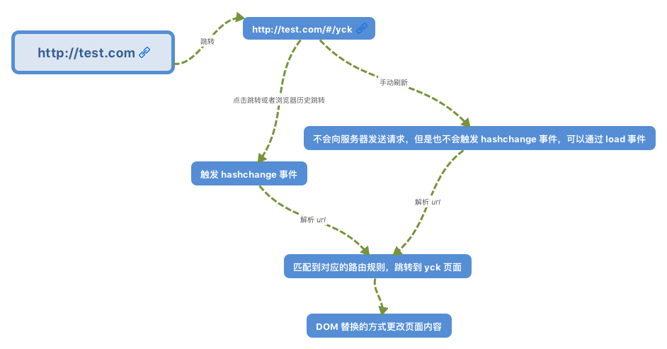

# vue-router

模仿官方撸一个简单的vue router

## vue-router 原理

vue-router使用的路由有两种模式

1.hash模式

2.history模式

本文只简单的实现vue-router的hash模式，先看一张图



图片出自[VueRouter 源码深度解析](https://juejin.im/post/5b5697675188251b11097464)

大概意思就是，利用hashchange事件，去监听hash值的变化，然后切换到相应的组件，原理很简单。

## vue-router实现

### 如何使用

既然是模仿，那路由的使用方式和官方是一模一样，在router文件夹里面新建一个index.js作为路由的配置

```
import Vue from 'vue'
import Router from '../plugins/router'

Vue.use(Router)

const HelloWorld = () => import('@/components/HelloWorld')
const About = () => import('@/components/about')

const routes = [
  {
    path: '/',
    component: HelloWorld
  },
  {
    path: '/about',
    component: About
  }
]

const router = new Router({
  // mode: 'history',
  routes
})

export default router
```
请自行新建路由引用的具体组件，这里引用的Router就是我们具体要实现的路由

然后在mian.js用使用路由

```
import Vue from 'vue'
import App from './App.vue'

Vue.config.productionTip = false

import router from './router'

new Vue({
  router,
  render: h => h(App),
}).$mount('#app')

```
准备工作完成。

### 路由实现

#### 第一步，先导出一个路由对象

```
class Router {

}
export default Router
```

#### 定义静态方法install

这个install是给Vue调用的，用来安装路由插件，当使用<code>Vue.use(Router)</code>的时候，Vue实际上调用了Router的install方法，并把vue实例通过参数传给install本身

这是vue内部的实现

```
export function initUse (Vue: GlobalAPI) {
  Vue.use = function (plugin: Function | Object) {
    // 判断重复安装插件
    const installedPlugins = (this._installedPlugins || (this._installedPlugins = []))
    if (installedPlugins.indexOf(plugin) > -1) {
      return this
    }
    const args = toArray(arguments, 1)
    // 插入 Vue
    args.unshift(this)
    // 一般插件都会有一个 install 函数
    // 通过该函数让插件可以使用 Vue
    if (typeof plugin.install === 'function') {
      plugin.install.apply(plugin, args)
    } else if (typeof plugin === 'function') {
      plugin.apply(null, args)
    }
    installedPlugins.push(plugin)
    return this
  }
}
```

在install的时候，通过mixin混合，做一些路由的init,大概这样子

```
static install(_Vue) {
    // 先缓存一下vue实例
    Vue = _Vue
    Vue.mixin({
      beforeCreate() {
        // 这里的options是指vue里面的options
        this.$options.router && this.$options.router.init()
      }
    })
  }
```

#### init

init做的事情比较多

1.通过绑定hashchange事件，监听hash变化

2.处理router map

3.初始化注册router-view，router-link组件

```
init() {
    // 监听hash
    this.bindEvents()
    // 处理路由
    this.createRouterMap()
    // 组件切换
    this.initComponent()
  }
```

#### bindEvents实现

```
 bindEvents() {
    window.addEventListener("hashchange", this.changeFn.bind(this), false)
    window.addEventListener("load", this.changeFn.bind(this), false)
  }
```

这里load的时候也做了处理，是为了解决第一次进入没有触发hashchange

```
 changeFn() {
    const hash = window.location.hash.slice(1) || '/'
  }

```

先拿到当前的hash值

#### 处理路由表 

在处理之前，先要拿到之前定义的map，之前map是通过new Router传进来的，所以，在构造函数中接收一下，并挂到options上面

```
constructor(options) {
    this.options = options
    this.routerMap = {}
  }
```

处理路由表，并把处理好的路由挂到routerMap上面，以便后面可以更好的通过hash切换组件

```
  createRouterMap() {
    this.options.routes.forEach(item => {
      this.routerMap[item.path] = item
    })
  }
```

#### 组件注册，切换

在注册之前，先要在constructor构造函数中通过Vue本身数据双向绑定的特性，绑定一下current hash,

```
this.app = new Vue({
  data: {
    current: '/'
    }
})
```

然后，这里是最关键的一步,注册router-view，router-link。

在有使用router-view的地方，把router-view替换成当前路由引用的组件

把router-link替换成a标签，并且把router-link里面的内容插入a标签里面

```
  initComponent() {
    Vue.component("router-view", {
      render: h => {
        const component = this.routerMap[this.app.current].component
        return h(component)
      }
    })
    Vue.component("router-link", {
      props: {
        to: String
      },
      render(h) {
        // h三个参数 组件名，参数，子元素
        return h("a", {
          attrs: {
            href: "#" + this.to
            }
          },
          [this.$slots.default]
        )
      }
    })
  }
```

最后，当hashchange触发的时候，把当前的hash赋值给current

```
changeFn() {
  const hash = window.location.hash.slice(1) || '/'
  this.app.current = hash
}
```


### 附上完整的代码

```
let Vue
class Router {
  static install(_Vue) {
    Vue = _Vue
    Vue.mixin({
      beforeCreate() {
        // 这里的options是指vue里面的options
        this.$options.router && this.$options.router.init()
      }
    })
  }

  constructor(options) {
    this.options = options
    this.routerMap = {}
    this.app = new Vue({
      data: {
        current: '/'
        }
    })
  }

  init() {
    // 监听hash
    this.bindEvents()
    // 处理路由
    this.createRouterMap()
    // 组件切换
    this.initComponent()
  }

  bindEvents() {
    window.addEventListener("hashchange", this.changeFn.bind(this), false)
    window.addEventListener("load", this.changeFn.bind(this), false)
  }

  changeFn() {
    const hash = window.location.hash.slice(1) || '/'
    this.app.current = hash
  }

  createRouterMap() {
    this.options.routes.forEach(item => {
      this.routerMap[item.path] = item
    })
  }

  initComponent() {
    Vue.component("router-view", {
      render: h => {
        const component = this.routerMap[this.app.current].component
        return h(component)
      }
    })
    Vue.component("router-link", {
      props: {
        to: String
      },
      render(h) {
        // h三个参数 组件名，参数，子元素
        return h("a", {
          attrs: {
            href: "#" + this.to
            }
          },
          [this.$slots.default]
        )
      }
    })
  }
}

export default Router
```

简单完成一个通过监听hash变化切换相应组件的vue router